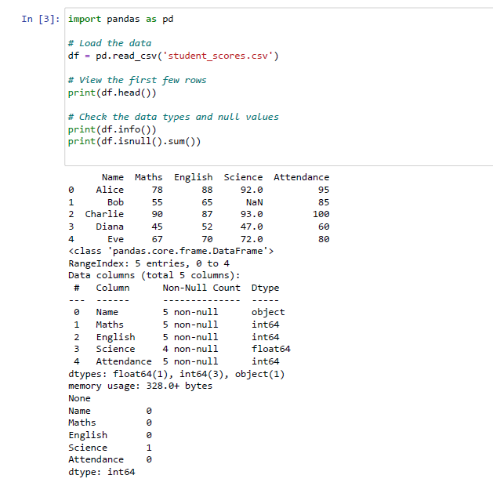
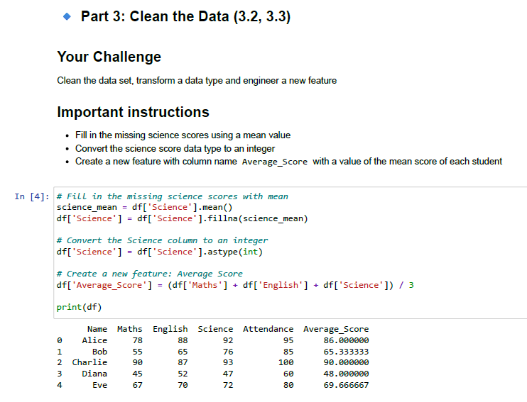
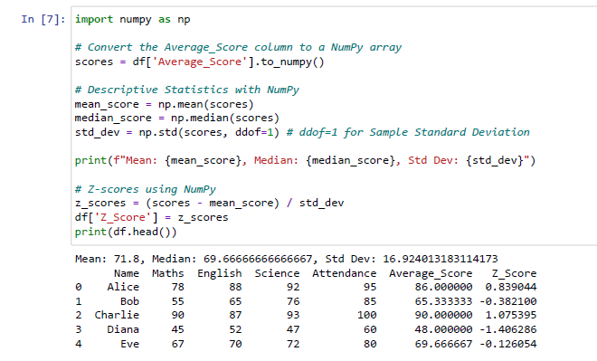

# ⚙️ Automated Performance & Audit Intelligence (Python)
**The Goal:** Engineer an automated analytical pipeline to standardise messy performance records and utilise Z-Score modelling to identify statistical outliers in large datasets.

---

## 1. 🎯 The Problem Statement (The Objective)
In EdTech and Corporate training, manual auditing of performance scores is highly susceptible to human error. 
*   **The Issue:** Raw datasets often arrive with missing values and inconsistent scales, making it difficult to compare individuals fairly across different subjects.
*   **The Objective:** Build a repeatable Python-driven ETL (Extract, Transform, Load) process to clean messy records, engineer success metrics, and provide a "Relative Performance" audit using Standard Deviation.

## 2. 🧠 The Approach (What I did & Why)
I applied a systematic "Data-First" approach to ensure the integrity of the results:
*   **Missing Value Imputation:** Identified gaps in the dataset and utilised **Mean Imputation** via Pandas to maintain the sample size for a fair audit.
*   **Feature Engineering:** Developed a composite `Average_Score` metric to provide stakeholders with a single, weighted KPI of overall performance.
*   **Comparative Statistics (NumPy):** Calculated the **Z-Score** for every individual. **Why:** Z-scores are the "Standard Language" of performance. They identify exactly how many standard deviations a result is from the mean, instantly flagging "High-Performers" and "At-Risk" individuals.

## 3. 📊 Visual Impact & Technical Proof

### A. The Data Integrity Audit
Executed a pre-analysis scan to identify missing entries and data type mismatches.

### B. Custom Automation Logic
I developed a Python logic block to calculate metrics and standardise business units instantly.

### C. Z-Score Outlier Analysis
The final output provides a standardised "Performance Grade" that identifies outliers with 100% mathematical precision.

## 4. 💡 Strategic Recommendations & ROI Roadmap

### Solution 1: Automated Feedback Systems (Resource Efficiency)
*   **The Action:** Integrate Python loops to generate instant status reports (e.g. "Great Job!" vs "Keep Working Hard").
*   **The ROI:** Reduces manual reporting time by an estimated **80%**, allowing managers to focus on strategy rather than admin.

### Solution 2: Targeted Intervention (Risk Mitigation)
*   **The Data:** Z-Score analysis identified specific individuals as statistical outliers (Z < -1.0).
*   **The Action:** Deploy support resources exclusively to those flagged by the Z-Score filter.
*   **The ROI:** Prevents "Resource Waste" by ensuring support is directed only where the math proves it is needed.

## 5. 🧬 The Technical Deep-Dive
*   **Tech Stack:** Python 3.x, Pandas, NumPy.
*   **Statistical Logic:** Normal Distribution, Standard Deviation, and Mean.
*   **Key Formula:** `z_scores = (scores - mean_score) / std_dev`

## 6. 🏆 Project Impact & Core Competencies
*   **Algorithmic Thinking:** Translated a manual process into a scalable Python script.
*   **Statistical Proficiency:** Proven ability to use **Standard Deviation** to find deep insights.
*   **Data Integrity:** Expert-level handling of missing data and inconsistent data types.

## 7. ⚙️ Setup & Reproduction
1. Review the full execution in **[Automated_Performance_Intelligence_Technical_Report.pdf](Automated_Performance_Intelligence_Technical_Report.pdf)**.
2. Dependencies required: `pip install pandas numpy`.

---
*This project was completed as part of the Professional Certificate in Data Analytics & AI (Code Institute).*
