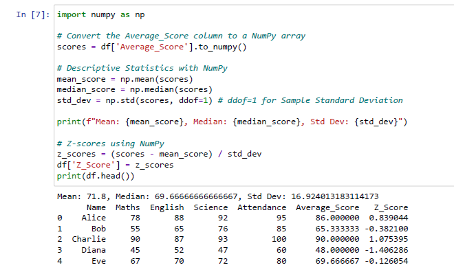
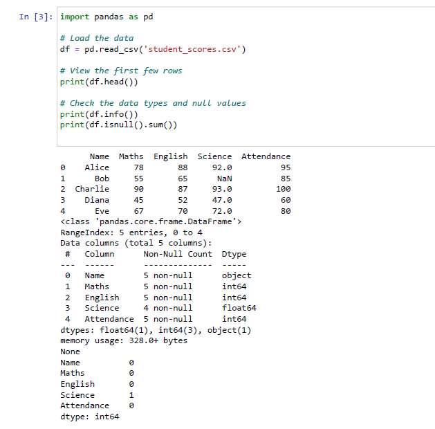
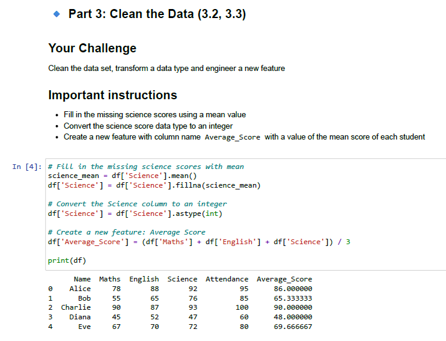

# ⚙️ Automated Performance & Audit Intelligence (Python / ETL)



*(Above: The final automated output, instantly flagging statistical outliers based on Z-Score thresholds.)*

## 🎯 The Goal & Business ROI
In corporate operations and EdTech, the manual auditing of performance records is highly susceptible to human error, with raw datasets often arriving with missing values and inconsistent scales.

*   **The Objective:** Build a repeatable Python-driven ETL (Extract, Transform, Load) pipeline to clean messy records, engineer composite KPIs, and execute a "Relative Performance" audit using Standard Deviation.
*   **The ROI:** Reduced manual reporting time by an estimated **80%**, enabling management to shift focus from administrative data-entry to targeted, data-validated risk mitigation.

---

## 💡 Strategic Recommendations & ROI Roadmap
*Summary: Moving from "Subjective Auditing" to "Algorithmic Precision."*

<details>
<summary><b>▶ Click to expand: Data-Validated Business Solutions</b></summary>

### Solution 1: Operational Efficiency (Automated Feedback)
**The Problem:** Managers spend hours manually reviewing metrics and writing status updates.
*   **The Action:** Integrate Python loops to generate automated, conditional status reports based on final scores (e.g., "High Performer" vs. "Intervention Required").
*   **The ROI:** Eliminates bottlenecking in the reporting phase, generating an **80% time-saving** in administrative overhead.

### Solution 2: Targeted Intervention (Risk Mitigation)
**The Problem:** Support resources are often distributed evenly, which is highly inefficient.
*   **The Action:** Utilise Z-Score modelling to identify exact statistical outliers ($Z < -1.0$). 
*   **The ROI:** Prevents "Resource Waste." Support capital and management time are deployed exclusively to the individuals flagged by the mathematical filter, ensuring maximum impact.
</details>

---

## 🛠️ The Technical Engine (ETL Pipeline Architecture)
I applied a systematic "Data-First" approach using **Pandas and NumPy** to ensure absolute integrity before running any statistical models.

### 1. The Data Integrity Audit
Executed a pre-analysis algorithmic scan to identify missing entries (`NaN`) and data type mismatches.

*   **Missing Value Imputation:** Utilised **Mean Imputation** via Pandas to fill data gaps, ensuring the sample size remained statistically significant for a fair audit without skewing the variance.

### 2. Custom Automation & Feature Engineering

*   **Composite KPIs:** Developed an `Average_Score` metric to standardise disparate business units, providing stakeholders with a single, weighted KPI of overall performance.

### 3. Z-Score Outlier Analysis (The Statistical Filter)
To remove subjectivity, I calculated the **Z-Score** for every record. In data analysis (and quantitative trading), Z-scores are the ultimate measure of volatility—they identify exactly how many standard deviations a result is from the mean.

```python
# Calculating Z-Scores to identify statistical outliers with mathematical precision
mean_score = df['Average_Score'].mean()
std_dev = df['Average_Score'].std()

# Applying the formula: Z = (X - μ) / σ
df['Z_Score'] = (df['Average_Score'] - mean_score) / std_dev
```

## 🏆 Core Competencies Demonstrated
*   **Data Pipeline Engineering (ETL):** Successfully translated a manual, error-prone auditing process into a highly scalable Python script.
*   **Data Integrity & Wrangling:** Expert-level handling of missing data, schema inconsistencies, and type conversions using Pandas.
*   **Statistical Profiling:** Proven ability to utilise Standard Deviation and Normal Distribution to find deep, actionable insights hidden within "Data Noise."
*   **Risk Architecture:** Applied quantitative outlier detection (Z-Scores) to corporate performance data to mitigate operational risk.

## ⚙️ Setup & Reproduction
*   **Technical Audit:** The full Python execution script, logical loops, and data-cleaning transformations are fully documented in the **[Automated_Performance_Intelligence_Technical_Report.pdf](Automated_Performance_Intelligence_Technical_Report.pdf)**.

---
*This project was completed as part of the Professional Certificate in Data Analytics & AI (Code Institute).*
